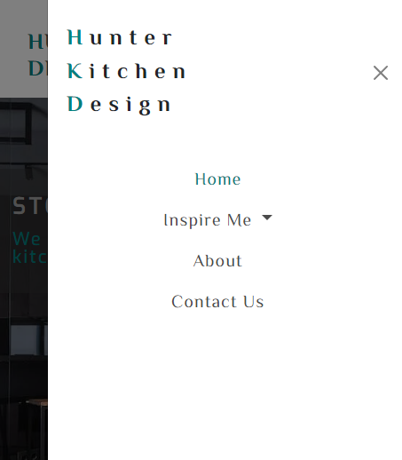

# <Hunter-Kitchen-Designs>

## Hunter Kitchen Designs

### Main Page
The main home page is the most important as this is the first page to grip the users interest and show them that this is where they want to be. For this reason, I wanted to keep the page modern, eye catching but yet subtle and I managed this by using an attractive image with neutral colours. I also gave it a zoom animation to draw the users attention along with the cover text to entice the users trust. The combination of this, along with the navigation bar and logo, altogether gives the user a welcoming feel for longevity and ease of use.

My motivation for this project was my parter, who is currently an up and coming kitchen designer and I wanted to create this site for her and the future of her career.

- Why did you build this project? (Note: the answer is not "Because it was a homework assignment.")
- What problem does it solve?
- What did you learn?

# Hunter Kitchen Design

Hunter Kitchen Design is a company that are there to help individuals who seek a kitchen designer and/or interior designer to work with clients to discuss all aspects of creating, remodeling, or updating the kitchen area of their home and give them a bespoke kitchen at the end of it.

Anybody can view our work and history throughout the page. 

all users can contact us through the form application and discuss anything surrounding the kitchen design and/or installation process, along with any queries.

You can see all about the company and meet the team in the About page.

 
[View the Hunter Kitchen Design project here](https://github.com/DarthKoder/Hunter-Kitchen-Designs)
- - -
## Table of Contents

### [User Experience (UX)](#user-experience-ux-1)
* [User Stories](#user-stories)
### [Features](#features)
* [Existing Features](#existing-features)
### [Features Left to Implement](#features-left-to-implement-1)
### [Design](#design-1)
### [Technologies Used](#technologies-used-1)
### [Frameworks, Libraries & Programs Used](#frameworks-libraries--programs-used-1)
### [Testing](#testing-1)
* [Validation Results](#validation-results)
* [Manual Testing](#manual-testing)
* [Lighthouse Report](#lighthouse-report)
### [Deployment and local development](#deployment-and-local-development-1)
* [GitHub Pages](#github-pages)
* [Forking the GitHub Repository](#forking-the-github-repository)
* [Local Clone](#local-clone)
### [Credits](#credits-1)
### [Acknowledgements](#acknowledgements-1)
---

## User Experience (UX)

This website is the help to help with the whole process of finding what type of kitchens they would like, and implementing them into reality.

There is clear navigation and a form set up on the contact us page to get in touch and discuss anything from quereies and plans to go ahead with any kitchen design and/or installations.

To help inspire the user with ideas for potential kitchen ideas, such as designs, colours, materials etc.

### User Stories

 * First-time visitor goals
    * Understand the main purpose of the site and learn more about Hunter Kitchen Designs and the kitchens they can provide.
    * Bring pleasure to the user with an attractive minimalistic site.
    * Easily navigate throughout the site.
    * Be able to find the Contact form and fill it out.
    
 * Returning visitor goals
    * Find out information about the company and the team.
    * Easily find contact information.
    * Review the site's extensive galleries.

 * Frequent user goals
    * Always being able to navigate their way.
    * Review the galleries for any new photos and inspiration.
    * Review all items to help decision making on the Things To Consider page.
    * Review any changes to the contacts information.
    * Contact the company at ay time.
- - -

## Features

* This website is targeting people who a bespoke kitchen in their home.
* The user can view all galleries and things to consider to help them make choices towards their new kitchen design.
* They can contact us with any queries or to make any bookings by navigating to the Contact Us page and filling out the form. 
* Responsive on all device sizes.

### Existing Features

* Navigation bar
    * It is featured and fixed on all seperate pages.
    * This has been reduced down and been place in the center to flow with the layout of the rest of the page.
    * I have used the same "El Messiri" font for this to compliment the logo as well as stand out againg the majority "Exo" font that has been used throughout the site. 
    * It contains a dropdown menu for the kitchen related items for ease of use and user expreience.
    * I have used the same colour co-ordination with the teal like #008080 as the highlighted "active" page, whilst having the mouse hover turn the text to the teal #008080 but in the dropdown menus a background colour of dark grey #4b4b4b will also appear. This is to make the user aware of what page they are on and also actively see what page they are potectially going to next when hovering over, this hover change does not work on the page currently active.
    * I removed the navbar toggler and navigation bar when viewed on a smaller screen and put in a sidebar navigation for this function.
    * Includes links to the logo, home page, gallery, and sign-up page.
    * It is identical in design across the pages.
    * Allows easy navigation from page to page without having to revert back to the previous page via the "back" button.

    

* Sidebar navigation 
    * The sidebar was used to tidy the screen up and input to increase user experience when used on smaller screens. 
    * It has all the same features and colourings as the navigation bar but it instead has a toggler situated in the top right corner and when activated the sidebar slides in from the right hand side of the screen and present the logo in vertical wording on the left hand side.
    * The navigation menu has the same features as the navigation bar, but is centered and in vertical format.
    * There is a "X" close button on situated on the right hand side of the logo text, you can also click anywhere else on the screen to close.

    

* Logo
    * I created something modern that stood out but was not to loud.
    * I used the "EL Messiri" font for this which seemed a nice fit and made it stand out against the main "Exo" font I used for the majority of the site.
    * The colours I used for this included a teal like colour #008080 which is the main colour I used for accenting the page along with the subtle dark grey #4b4b4b.
    * These colours are used throughout the site for recognition and user comfort.
    * It has been reduced when on smaller screen sizes along with being situated on the left with no slogan as to not make the screen too cluttered for user experience - this will reduce down to vertical wording it on very small screens similar to side bar layout.
    * The wording has been place vertically when used in the sidebar navigation system whitch uses the highlighted HKD well.
    * It has a minaimalistic attractive feel to it.

* Main Headings 

    * Are composed of simple teal like colour #008080 capitalised text with 'Dancing Script' font, other than the main page cover heading text uses 'Exo' font.
    * All but the about page heading reduce down and are positioned on the left hand side when viewed on smaller screens. 
    * Main heading, which is unique for each page:
        * The home page is comprised of cover text 'STOP HUNTING We have the perfect kitchen for you' with section headings.
            * This page is to attract users and give them a little taste of the company and what can do for them.

            
            

            *  Section one, 'We Are Hear For You'.
                * This section contains a short decriptive paragraph.
                * It gives us a brief description of the company and what it has to offer.

                    

            * Section two, 'Why Hunter Kitchens?'.
                * this consits of a few short paragraphs.
                * It has a short description the company and how it works.
                * Shows the user what to expect and what we can accomplish working together.
                * Gives a sense of quality and high standard to the company.

                    

        * Modern kitchen gallery is made up of 'Some Modern Inspiration...'.
            * This page is a gallery for users to see some of the modern kitchens we have installed and to inspire them with their designs.

        
        

        * Traditional kitchen gallery has the heading of 'Some Traditional Inspiration...'
            * This page is a gallery for users to see some of the traditional kitchens we have installed and to inspire them with their designs.

        
        

        * Things to comsider is comprised of 'Things To Consider...'.
            * This page is to help the user spark some ideas as to what to think about when designing a kitchen, such as colours, materials etc. 

        
        

        * About page is comprised of 'Our Story'.
            * The about page tells th user the story of Hunter Kitchen Designs and introduces them to the team behind it all.
                * It also contains a small line of emotionally grabbing text 'Stories help us to give meaning to the things around us. This is ours'. 

                
                

        * Contact page consists of 'Get In Touch' 
            * This page is for contacting the company.
            * It has a form to fill out with an email address and a textarea for writing a message. 

                

                * This page also has a modal that thanks the user for sending a message once it has been submitted. 
                * The heading reads 'Thank You!'.

                

* Home Page
    * The main home page is the most important as this is the first page to grip the users interest and show them that this is where they want to be.
    * For this reason, I wanted to keep the page modern, eye catching but yet subtle.
    * I managed this by using an attractive image with neutral colours.
        * I also gave it a zoom animation to draw the users attention along with the cover text to entice the users trust.
    * The combination of this, along with the navigation bar and logo, altogether gives the user a welcoming feel for longevity and ease of use.

    
    
    
    
    

* Gallery Pages
    * There are two gallery pages, modern & traditional. 
    * They are images in grid layout for ther user to look at for inspiration and to see the companies previous projects. 
    * Each individual image has a hover animation.
    * Each image can be clicked as a link and will take you to a seperate tab to be viewed full-size.
    * The galleries are responsive and will reduce down to 1 column on smaller screens. 

    
    
    
    

* Things To Consider Page
    * This page is to help identify a few things regarding kitchen design.  
    * It is to help the user spark some ideas as to what to think about when designing a kitchen, such as colours, materials etc. 
    * It is also responsive and reduces down to a single column on smaller screen sizes. 

    
    

* About Page
    * This section will allow users to get information about Hunter Kitchen Design.
    * This page gives an overview of the companies story. 
    * You can see more about the team.
    * There are sections with different pieces of information for the user regarding the company.
    
    
    

    * Section one, 'THE BEGINNING'.
        * This section contains a short decriptive paragraph.
        * It gives us a brief description of how the company came to be, its origin story.

        

    * Section two, 'OUR PROCESS'
        * This consits of a short paragraph.
        * It has a short description the company approaches things along the way.
        * Shows the user how they will be treated.

        

    * Section three, 'THE HUNTER DIFFERENCE'
        * This entails of a short paragraph.
        * This tells the user what is different about Hunter Kitchen Designs and why they should choose them.
        * Shows the user why HKD stands out above the rest.

        

    * Section four, 'MEET THE TEAM'
        * This is the second part of the page introducing the team members.
        * It has circular images with text underneath them acting as quotations.
        * They also respond a reduce down into single file when on smaller screens.

        
        

* Footer
    * Links to the social media for Lunar Escape will open in a new tab to allow easy navigation for the user.
    * It is valuable to the user as it gives them an easy contact option via social media.
    * Hold copyright information about the author. 

* The Sign Up page
    * This page will allow users to choose a package, sign up for it, and win a trip to the moon in a lucky draw.
    * The user can choose a regular flight and explore the surface of both of these to be in the lucky draw.
    * In the future, there might be more packages to choose from. 

* The Sign Up received page
    * Form received

---

## Features Left to Implement

* The colouring was important to me and I wanted to emphasise the First letters of each work that can later shortened to HKD and possibly be used to create and emblem for the company. I envisioned this emblem as the capitalised letters being verticaly staggered in a steplike fashion.
* Add radio buttons to the form to highlight what type of kitchen the user is interested in.
* Updated gallery with additional images.
* In the future, there could be an online academy that will teach aerospace engineering, which you could join through this website.
---

## Design

 * Colour Scheme
    * Primary colors used on the website: 

 * Typography
    * Kanit font is main font used throughout the ite with sans-serif as its fallback font in case Kanit doesn't import for some reasson.

 * Wireframes
    * Pen and paper in a notebook: simple and effective.
---

## Bug fixes 

The navigation bar at first was situated on the left with a larger brand logo as the main home navigation and a toggler on the right when in a smaller screen. I removed the brand logo as it was not visually clean and I had trouble moving it along with the other nevigation text with Bootstraps design. The toggler was stuck at athe same height as the navbar which is situated under the logo text and this was not visually desireable, which was then replaced with the sidebar toggler which was then situated in line with the logo on the top right of the screen, this also came with its own issues. The issue I ran into with the sidebar and toggler was that with Bootstraps design, it was causing a column of whitespace down the right side of the page which I overcame by painstakingly tryihng to find out what Bootstrap css classes were causing this and I finally found the issues and resolved them using my custom CSS.

socials in footer
---

## Technologies Used

 * [HTML5](https://en.wikipedia.org/wiki/HTML5)
 * [CSS3](https://en.wikipedia.org/wiki/CSS)

---

## Frameworks, Libraries & Programs Used

 * [Gitpod](https://www.gitpod.io/)
    * To write the code.
 * [Git](https://git-scm.com/)
    * for vesion control.
 * [Github](https://github.com/)
    * Deployment of the website and storing the files online.
 * [Google Fonts](https://fonts.google.com/)
    * Import main font the website.
* [Am I Responsive](https://ui.dev/amiresponsive)
    * Mockup picture for the README file.
---

## Testing

The W3C Markup Validator and W3C CSS Validator services were used to validate every page of the project to ensure there were no errors.

 * [W3C Markup Validtor](https://validator.w3.org/)
 * [W3C CSS Validator](https://jigsaw.w3.org/css-validator/)

### Validation results

index.html

gallery.html

sign-up.html

form-received.htmml

style.css

### Manual Testing

* The website was tested on Google Chrome, Microsoft Edge, and Opera browsers.
* The website was viewed on a desktop computer, laptop, and Samsung Galaxy A52 mobile phone.
* A large amount of testing was done to ensure links between pages are working correctly on all pages.
* Family and friends were asked to review the website for a better understanding of the user experience.
* Dev Tools was used to test how the site looks on various screen sizes.

### Lighthouse Report

#### Mobile analysis

Home Page

Gallery

Sign Up

Application Received

#### Desktop analysis

Home Page

Gallery

Sign Up

Application Received

---

## Deployment and local development

### GitHub Pages

GitHub Pages used to deploy live version of the website.
1. Log in to GitHub and locate [GitHub Repository Lunar Escape](https://github.com/Thomas-Tomo/Lunar-Escape)
2. At the top of the Repository(not the main navigation) locate "Settings" button on the menu.
3. Scroll down the Settings page until you locate "GitHub Pages".
4. Under "Source", click the dropdown menu "None" and select "Main" and click "Save".
5. The page will automatically refresh.
6. Scroll back to locate the now-published site [link](https://thomas-tomo.github.io/Lunar-Escape/index.html) in the "GitHub Pages" section.

### Forking the GitHub Repository

By forking the repository, we make a copy of the original repository on our GitHub account to view and change without affecting the original repository by using these steps:

1. Log in to GitHub and locate [GitHub Repository Lunar Escape](https://github.com/Thomas-Tomo/Lunar-Escape)
2. At the top of the Repository(under the main navigation) locate "Fork" button.
3. Now you should have a copy of the original repository in your GitHub account.

### Local Clone

1. Log in to GitHub and locate [GitHub Repository Lunar Escape](https://github.com/Thomas-Tomo/Lunar-Escape)
2. Under the repository name click "Clone or download"
3. Click on the code button, select clone with HTTPS, SSH or GitHub CLI and copy the link shown.
4. Open Git Bash
5. Change the current working directory to the location where you want the cloned directory to be made.
6. Type `git clone` and then paste The URL copied in the step 3.
7. Press Enter and your local clone will be created.

---

## Credits

### Code
 * Understanding the concept of flexbox was learned through [Complete Guide to Flexbox](https://css-tricks.com/snippets/css/a-guide-to-flexbox/)
 * The README template was helpfully provided by [Code Institute (template)](https://github.com/Code-Institute-Solutions/SampleREADME)

### Content

 * All content was written by the developer.
 * [Color contrast checker](https://coolors.co/contrast-checker/112a46-acc8e5) was used to decide which colors would be used for the website.

### Media 

 * [Pexels](https://www.pexels.com/) free stock photos, royalty free images.
 * [Pixabay](https://pixabay.com/) free stock photos, royalty free images.
 * [Pixlr](https://pixlr.com/) Resizing images.
---

## Acknowledgements

 * My mentor Mitko Bachvarov provided helpful feedback and a link to the Flexbox guide.
 * Slack community for encouragement and information.